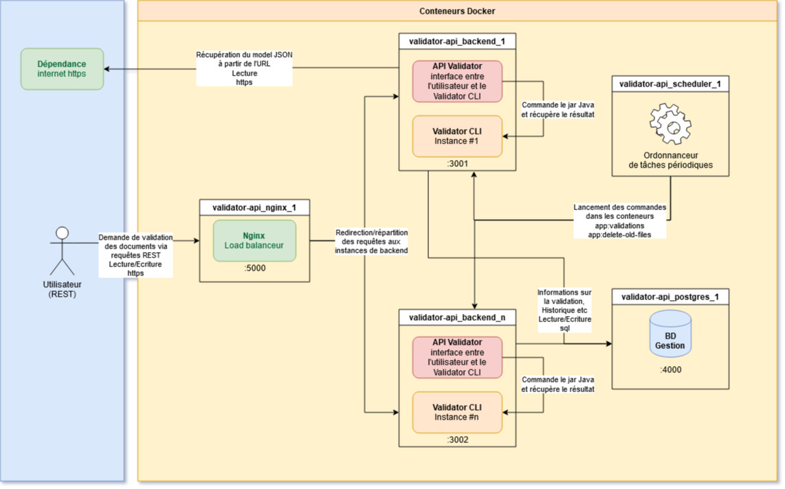

# validator-api

# About

APIsation of [Validator](https://github.com/IGNF/validator), a tool developed by [IGNfab (IGN)](https://www.ign.fr/ignfab), that allows to validate and normalize datasets according to a file mapping and a FeatureCatalog. [Learn more](https://github.com/IGNF/validator).

# Installation/deployment

## Requirements

 * A Linux distro (preferably Debian-based) as the host machine
 * Git
 * [Docker Engine](https://docs.docker.com/engine/install/)
   * [Configure proxy server for docker](https://docs.docker.com/network/proxy/)

## Docker-Compose



This application is composed of:
```yml
# docker-compose.yml
...
services:
  backend: # custom docker image for this symfony app. Checkout dockerfile for more info
    build:
      context: .
      dockerfile: .docker/backend.dockerfile
    ...
    networks:
      - symfony

  postgres: # postgres database instance, built from a prexisting docker image
    image: postgres:10
    ...
    networks:
      - symfony

  nginx:  # nginx for loadbalancing multiple instances of "backend", built from prexisting docker image
    image: nginx:latest
    volumes:
      - ./.docker/nginx.conf:/etc/nginx/nginx.conf # nginx config file
    networks:
      - symfony
    depends_on:
      - backend

  scheduler:  # crontab-like tool for docker, used for scheduling jobs inside docker containers, built from prexisting docker image
    image: mcuadros/ofelia:latest
    volumes:
      - /var/run/docker.sock:/var/run/docker.sock:ro
      - ./.docker/scheduler-config.ini:/etc/ofelia/config.ini
    depends_on:
      - backend

networks:
  symfony: # all services are under the same virtual network

volumes:
  db-data: # database data persistence on host machine, prevents deletion of data even after the container has been stopped
...
```
> Checkout the entire [docker-compose.yml](docker-compose.yml) file for more precisions.  
> [More info on the scheduler](https://github.com/mcuadros/ofelia).

## Steps

1. Launch docker containers: `docker-compose up -d --build --scale backend=2`

> Current configuration is set to launch 2 instances of "backend". [See here how to change that](doc/md/backend_multiple_instances_en.md).

2. Create a file named `.env.local` in the root directory of the project with the following information.

```ini
APP_ENV=dev

DATABASE_URL=postgresql://db_user:db_password@db_host:db_port/db_name?serverVersion=10&charset=utf8

POSTGRES_USER=db_user
POSTGRES_PASSWORD=db_password
POSTGRES_DB=db_name

http_proxy=
https_proxy=
HTTP_PROXY=
HTTPS_PROXY=
```
> [How to configure DATABASE_URL (Symfony docs)](https://symfony.com/doc/4.4/doctrine.html#configuring-the-database)

> Prefix for the following commands: `docker exec -it validator-api_backend_1 ...`  
> Production-environment-specific commands are given in *italics*

3. Install PHP dependencies: `composer update` *or `composer update --no-dev`*
4. Install JavaScript dependencies: `yarn install` *or `yarn install --production`*
5. Create database: `php bin/console doctrine:database:create --if-not-exists`
6. Update database schema: `echo yes | php bin/console doctrine:migrations:migrate`
7. Compile assets: `yarn encore dev` *or `yarn encore production --progress`*

# Testing

## Docker-Compose

Testing needs only 2 containers, one for the Symfony app and one for the database, as only the Symfony app is tested.
```yml
# docker-compose.test-yml
...
services:
  backend_test:
    build:
      context: .
      dockerfile: .docker/backend.dockerfile
    env_file:
      - .env.test
    networks:
      - symfony

  postgres_test:
    image: postgres:10
    env_file:
      - .env.test
    ...
    networks:
      - symfony
...
```
> Checkout the entire [docker-compose.test.yml](docker-compose.test.yml) file for more precisions.

## Steps

1. Launch docker containers: `docker-compose -f docker-compose.test.yml up -d --build`
2. Create a file named `.env.test` in the root directory of the project with the following information. `APP_DEV` variable must be set to `test`.

```ini
APP_ENV=test

DATABASE_URL=postgresql://db_user:db_password@db_host:db_port/db_name?serverVersion=10&charset=utf8

POSTGRES_USER=db_user
POSTGRES_PASSWORD=db_password
POSTGRES_DB=db_name

http_proxy=
https_proxy=
HTTP_PROXY=
HTTPS_PROXY=
```
> [How to configure DATABASE_URL (Symfony docs)](https://symfony.com/doc/4.4/doctrine.html#configuring-the-database)

> Prefix for the following commands: `docker exec -it validator-api_backend_test_1 ...`

3. Install PHP dependencies: `composer update`
4. Create database: `php bin/console --env=test doctrine:database:create --if-not-exists`
5. Update database schema: `php bin/console --env=test doctrine:migrations:migrate --no-interaction`
6. Launch tests: `vendor/bin/simple-phpunit`