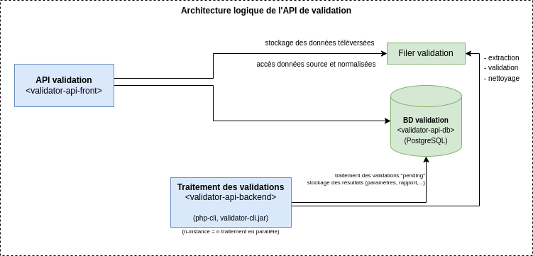

# Documentation développeur

## Architecture

## Liens utiles

* Dépôt GitHub : [https://github.com/IGNF/validator-api](https://github.com/IGNF/validator-api)
* Intégration continue avec [GitHub actions](https://github.com/IGNF/validator-api/actions) configurée via le dossier [.github/workflows](https://github.com/IGNF/validator-api/tree/master/.github/workflows)

## Données des tests

* Les jeux tests sont dans le dossier `${projectDir}/tests/data`
* Les modèles de données tests utilisés sont des modèles externes (ex : https://www.geoportail-urbanisme.gouv.fr/standard/cnig_SUP_PM3_2016.json)

## Procédure d'installation

* [Documentation développeur pour développement PHP classique](developer-guide/php-classic.md)
* [Documentation développeur pour développement avec docker](developer-guide/docker.md)
* [Documentation développeur pour le développement du front (JavaScript)](developer-guide/front.md)

